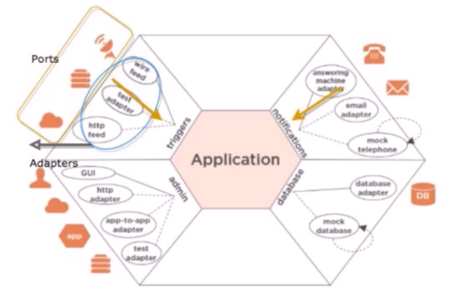

# Hexagonal architecture
Called Ports and adapters too, it is Architecure design pattern. Is a bigpicture about design of software. It is too a guideline, understanding the benefits. The focus are business requirements, trying to delay technical decisions, following agile principles.
The goal is create a sofware that can be excute for users, programs or tests, providing a good enviroment to isolation test.

## Isolation
The main concept is isolation. We can separe the architecture in three blocks or areas:
- The center of the hexagon
- Left side, outside of the hexagon
- Right side, outside of the hexagon 

Inside, we have the business rules, all logic of the solution. The center must to be agnostic for technology, intrastructure or famework, exceptions like log or IoC.

Left side, we have the external actors to trigger events on our software. Rest, UI, etc.

Right side, we have stuffs about infrastructure, that means call HTTP, filesystem, database, etc. 

## Actors
Outside of hexagon, anything that interact with the software is called `Actor`. Two tyes of actors:
- Driver is a main conductor. How starts the interaction, UI, rest endpoint, consumer queue
- Driven. Some parts the recives the interaction, that may be bidirectional (`repository`, por example a database) or unidirectional (`recipeient`, SMTP or queue)

## Dependencies
The dependencies are all from the center. Centre depends from nobody, Right side depends from the center, Left side depends from the center too.

## Ports
Interactions happen through ports. Resuming, a port is an OOP interface. 
- Primary port: Used by driver actor, is an API interaction like add items to shopping cart, pay a bill, do bank transfer, etc. Usually, the port correspon to an use case
- Secundary port: used by driven actor, is a SPI interaction like acessing to database, send to queue, etc.

Note: the `implementation of primary port interfaces must to be inside` the hexagon. The `implementation of secundary port interfaces must to be outside` the hexagon, because use especifics technologies.

## Adapters
Adapters are pieces of software that allow to external techs interact with ports. They are, essentially, converters.

## Execution flow
Thinking about execution flow, it seems that the Centre of Hexagon depends on Right side, but we don't want this. To achieve this goal, we can use IoC.

